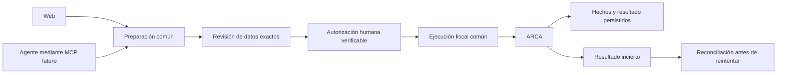

# Dirección de arquitectura y futura operación asistida

Última revisión: 03/10/2026

Estado: dirección aceptada; el MCP y los contratos de autorización aquí descritos
son futuros, no capacidades implementadas.

## Propósito

FactuFlow debe permitir que una persona opere desde la web o, más adelante,
desde un agente: preparar una factura para un emisor y un cliente, revisar un
Excel o preparar un lote. Ambos canales deben ejecutar los mismos casos de uso
y conservar las mismas garantías. Esta evolución madura la facturación dentro
del alcance de `VISION.md`; no requiere ampliar el producto a CRM, contabilidad
integral ni incorporar un proveedor de modelos al servidor.

La visión permanece protegida. La secuencia pertenece a
[`ROADMAP.md`](../../ROADMAP.md); los hechos y límites de la revisión inicial
están en la [auditoría integral](../project/analysis/auditoria-integral-2026-10.md).

## Estructura que debemos conservar

Mantener un monolito modular con PostgreSQL o SQLite según instalación, API,
worker y adaptadores externos. No introducir microservicios, otra cola, un motor
de agentes o infraestructura adicional sólo para habilitar otro canal.

| Responsabilidad | Dueño | Regla para cambios |
|---|---|---|
| Identidad y alcance | Autorización de aplicación respaldada por base | Usuario, emisor y ambiente explícitos; almacenamiento web y argumentos del agente no conceden permisos |
| Importación y datos registrales | Adaptadores Excel/padrón y normalización | Producen datos con procedencia; un dato externo no es una instrucción ejecutable |
| Preparación fiscal | Contrato común de aplicación sobre reglas de dominio | Validar identificación, categorías, importes, fechas y persistencia; sin CAE, reserva ni consultas registrales obligatorias en el envío |
| Revisión y autorización humana | Canal de interacción y verificación de aplicación | Vincular la decisión con la preparación exacta; conservar fecha, punto de venta y consecuencias visibles |
| Ejecución y recuperación | Casos de uso fiscales existentes | Revalidación, idempotencia, ownership, estados inciertos y reconciliación comunes a API y worker |
| Hechos históricos y lecturas | Evidencia fiscal y proyecciones de PDF/reportes | Consumir hechos congelados y moneda explícita; no recalcular historia desde perfiles, clientes o cotizaciones actuales |
| Interfaces | HTTP/web y futuro MCP | Adaptadores delgados; no duplicar cálculos, permisos, numeración ni reglas de recuperación |

Los nombres de la tabla describen responsabilidades; no exigen crear paquetes
con esos nombres ni una reescritura previa. Hoy algunas responsabilidades están
concentradas en servicios y vistas extensos. Separarlas al intervenir el contrato
afectado, con pruebas de sus consumidores; no trasladar bloques por tamaño ni
crear una abstracción sin uso real.

Actualmente los routers también contienen autorización, replay, compare-and-swap
y recuperación. Invocar `FacturacionService` directamente desde un MCP podría
omitir esas protecciones. Al extraer el caso de uso común deben trasladarse
conjuntamente sus controles y contexto autorizado, conservando los contratos HTTP
y las pruebas; cambiar el transporte no habilita un atajo a servicios internos.

## Preparar, autorizar y ejecutar

La preparación identifica usuario, emisor, ambiente, revisión de datos y alcance
de la operación. La autorización corresponde a esa misma preparación. Si
cambian sus datos o permisos, la aplicación debe detectar la diferencia antes de
la frontera irreversible. Un replay conserva el resultado durable; un timeout
no autoriza a repetir una solicitud de CAE.

La emisión individual actual recibe `confirmacion_fecha_fiscal` y los lotes
vinculan su confirmación con una revisión. Esos contratos no prueban por sí solos
que un humano aprobó una llamada originada por un modelo: el modelo puede enviar
los parámetros. Antes de exponer emisión por MCP hay que definir una autorización
que el agente no pueda fabricarse, verificable por el servidor y vinculada a
usuario, emisor, preparación e idempotencia. El mecanismo y la interfaz se
decidirán en ese corte, reutilizando la revisión existente, sin añadir una
cadena de confirmaciones ni vencimientos administrativos arbitrarios.

La especificación MCP recomienda control humano sobre herramientas y recuerda
que sus anotaciones son metadatos, no controles de autorización. Nuestra frontera
fiscal exige además la confirmación irreversible definida en `AGENTS.md`.
Referencia: [herramientas MCP, revisión 2026-07-28](https://modelcontextprotocol.io/specification/2026-07-28/server/tools).

Para un transporte HTTP futuro, definir credenciales de alcance mínimo y
audiencia correcta, con revocación y separación entre consultar, preparar y
emitir. No reutilizar credenciales ARCA como credenciales del agente ni compartir
tokens entre servicios. La elección de transporte permanece abierta.
Referencias: [autorización MCP](https://modelcontextprotocol.io/specification/2026-07-28/basic/authorization)
y [prácticas de seguridad](https://modelcontextprotocol.io/specification/2026-07-28/basic/security_best_practices).

## Ejemplos de experiencia futura

- «Prepará una factura del emisor X para el cliente Y»: resolver únicamente
  identidades autorizadas, pedir datos faltantes —incluida fecha explícita—,
  preparar y mostrar el resumen. La emisión sigue requiriendo autorización
  humana del contenido exacto.
- «Revisá este Excel y prepará el lote»: usar importación, validación y
  preparación comunes; presentar errores, procedencia, duplicados y totales.
  Preparar el lote no solicita CAE.
- «¿Qué pasó con la operación?»: consultar su resultado durable y ofrecer la
  recuperación aplicable; no repetir el envío por iniciativa del modelo.

El MCP devuelve únicamente los datos necesarios para la tarea y el emisor
autorizado. Un archivo, descripción de cliente, respuesta externa o resultado de
herramienta se trata como datos no confiables. El agente no obtiene SQL, shell,
claves privadas, administración global ni acceso directo a WSAA/WSFE por esta
integración. Conservar sólo evidencia mínima para auditar autor y operación,
sin guardar conversaciones completas ni archivos originales indefinidamente.

## Cómo evaluar cada reparación desde ahora

Antes de cerrar una unidad, comprobar:

1. ¿La regla tiene un dueño común y cubre API, web, worker e importación que la
   consumen, en vez de corregir sólo una pantalla?
2. ¿Los datos admisibles pueden persistirse fielmente antes y después de CAE?
3. ¿La identidad y las respuestas tardías pertenecen al contexto explícito?
4. ¿Preparación, revisión, solicitud y evidencia describen la misma operación?
5. ¿Una interfaz nueva puede reutilizar el contrato sin eludir permisos o
   fabricar autorización humana?
6. ¿El cambio conserva errores, concurrencia, replay e incertidumbre, con una
   recuperación concreta y coste proporcional a una instalación pequeña?

La [puerta de calidad](change-quality-gates.md) y el
[checklist fiscal](fiscal-change-checklist.md) siguen gobernando la implementación.
Este criterio orienta los cortes existentes; no autoriza implementar el MCP ni
convierte todas las mejoras de plataforma en un prerrequisito indivisible.
