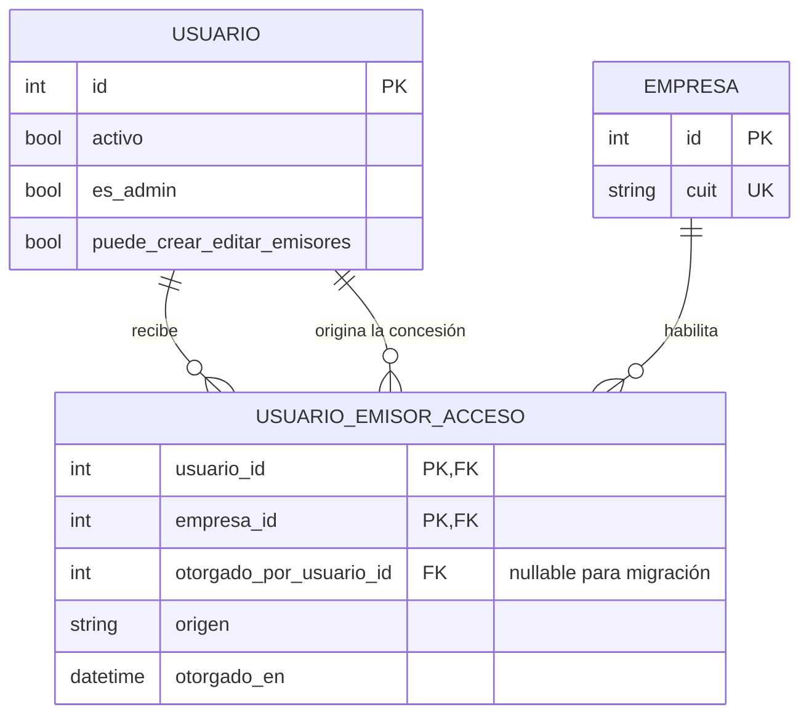

# Diseño PF-06/PF-07/PF-08 — permisos operativos multiemisor

Última actualización: 2026-09-02

Estado: CERRADO Y PUBLICADO EN `v0.3.5`; DESPLIEGUE PENDIENTE

## Objetivo

Permitir que un usuario operativo trabaje con uno o varios emisores y, cuando
un administrador lo autorice expresamente, pueda crear emisores y editar la
ficha de los emisores que ya tiene habilitados. El cambio no convierte al
usuario en administrador ni incorpora permisos finos por módulo.

Este diseño mantiene las fronteras de `VISION.md`:

- un único emisor activo explícito por vez;
- aislamiento estricto de datos entre emisores;
- administración de usuarios y del sistema reservada a administradores;
- ninguna operación simultánea mezclada ni reporte global consolidado;
- experiencia comprensible para personal administrativo no técnico.

## Decisión de producto

Se conservan dos roles:

1. `Administrador`: acceso global y administración completa.
2. `Operador`: acceso operativo únicamente a emisores asignados.

Al operador se le puede otorgar una sola capacidad adicional mediante el
checkbox visible `Puede crear y editar emisores`. El nombre técnico propuesto es
`puede_crear_editar_emisores`; debe ser booleano, `NOT NULL` y `false` por
defecto.

No se separan permisos de crear y editar porque el producto no necesita todavía
esa granularidad. La capacidad tampoco incluye eliminar emisores, administrar
usuarios, conceder accesos, entrar a `Sistema`, gestionar almacenamiento ni
modificar plantillas globales.

## Matriz de autorización

| Acción | Administrador | Operador sin capacidad | Operador con capacidad |
|---|---|---|---|
| Ver y operar un emisor asignado | Sí, todos | Sí | Sí |
| Ver u operar un emisor no asignado | Sí | No | No |
| Crear un emisor | Sí | No | Sí |
| Obtener acceso al emisor que acaba de crear | Ya tiene acceso global | No aplica | Sí, en la misma transacción |
| Editar un emisor asignado | Sí | No | Sí |
| Editar un emisor no asignado | Sí | No | No |
| Eliminar un emisor | Sí, sujeto a las guardas existentes | No | No |
| Asignar o revocar emisores a usuarios | Sí | No | No |
| Otorgar la capacidad de crear y editar | Sí | No | No |
| Administrar usuarios, `Sistema` o almacenamiento | Sí | No | No |

La autorización para editar se expresa siempre como una conjunción:

```text
es_admin
OR
(puede_crear_editar_emisores AND tiene_acceso_operativo_al_emisor)
```

Tener la capacidad sin acceso al emisor no alcanza. Haber creado el emisor en
el pasado tampoco concede propiedad permanente: si un administrador revoca el
acceso operativo, el creador deja inmediatamente de poder verlo, operarlo o
editarlo.

## Modelo de datos objetivo



`USUARIO_EMISOR_ACCESO` reemplaza como autoridad a la relación singular
`usuarios.empresa_id`. Debe tener clave o constraint único por
`(usuario_id, empresa_id)`, índices para resolver ambos sentidos y claves
foráneas compatibles con SQLite y PostgreSQL.

`origen` debe ser un conjunto cerrado, al menos:

- `migracion_legacy`;
- `asignacion_admin`;
- `creacion_propia`.

El origen sirve para auditoría, no para autorizar. Todos los accesos pueden ser
revocados por un administrador bajo las mismas reglas.

No se agrega inicialmente un modo dinámico `todos los emisores presentes y
futuros`. La UI puede ofrecer `Seleccionar todos los emisores actuales`, pero
debe materializar asignaciones explícitas. Un emisor creado mañana no queda
expuesto automáticamente a operadores existentes.

## Invariantes no negociables

1. El backend es la única autoridad. Ocultar botones, filtrar el selector o usar
   guards de Vue solo mejora la UX y nunca reemplaza la autorización de API.
2. Un operador solo puede seleccionar, consultar y operar emisores presentes en
   `usuario_emisor_acceso`.
3. `puede_crear_editar_emisores=true` no amplía por sí solo el conjunto de
   emisores visibles o editables.
   Desactivar la capacidad impide nuevas creaciones y ediciones, pero no revoca
   los accesos operativos; revocar un acceso tampoco cambia la capacidad global.
4. Crear el emisor y conceder acceso al creador es una única transacción: o se
   confirman ambos efectos y su evento de auditoría, o no se confirma ninguno.
5. La revocación elimina la autoridad efectiva desde el siguiente control
   backend para iniciar nuevas acciones. No se confían permisos guardados en
   Pinia, almacenamiento web o JWT. Una solicitud individual ya aceptada o un
   lote ya confirmado y encolado conserva su autorización original y puede
   terminar; reiniciar el worker es continuación del mismo trabajo, no una nueva
   concesión.
6. Los administradores conservan acceso implícito a todos los emisores. Sus
   asignaciones explícitas, si existen, no limitan ese rol.
7. Al degradar un administrador a operador, solo conserva los accesos explícitos
   que tenga. Si no tiene ninguno, queda sin capacidad operativa hasta que otro
   administrador le asigne emisores.
8. El permiso nuevo nunca habilita el borrado de emisores.
9. La edición autorizada no evita las guardas actuales de identidad fiscal: un
   emisor con historial operativo o fiscal conserva bloqueados los campos que
   no pueden modificarse con seguridad.
10. Clientes, certificados, puntos de venta, comprobantes, lotes, PDFs,
    reportes, perfiles y formatos continúan validados contra el emisor activo en
    cada acceso por ID, query, body o header.
11. Con cero accesos, el operador puede autenticarse pero no operar. Con uno,
    puede seleccionarse automáticamente. Con más de uno, toda operación exige
    un emisor activo explícito y autorizado.
12. Ningún cambio de permisos autoriza reintentos fiscales, altera idempotencia,
    cambia fechas fiscales ni flexibiliza confirmaciones irreversibles.

## Resolución central de permisos

La implementación no debe dispersar condicionales por endpoints. Debe
centralizar helpers o dependencias con semántica explícita:

- `puede_operar_empresa(usuario, empresa_id)`:
  administrador o asignación vigente;
- `puede_crear_empresa(usuario)`:
  usuario activo y (`es_admin` o `puede_crear_editar_emisores`);
- `puede_editar_empresa(usuario, empresa_id)`:
  administrador o (capacidad vigente y asignación vigente);
- `puede_eliminar_empresa(usuario)`:
  solo administrador.

`GET /api/empresas` debe devolver todos los emisores para administradores y solo
los asignados para operadores. La lista no debe salir del contenido del JWT: se
resuelve contra base para que altas y revocaciones tengan efecto sin esperar el
vencimiento de la sesión.

Los modelos Pydantic administrativos deben incorporar explícitamente:

- `empresa_ids: list[int]` normalizada, sin duplicados y con IDs existentes;
- `puede_crear_editar_emisores: bool`;
- modelos de respuesta diferenciados cuando un usuario común no necesite ver
  metadatos administrativos de permisos.

## Flujo de creación de un emisor por un operador

Orden obligatorio dentro de una transacción:

1. autenticar y releer usuario activo;
2. bloquear o versionar el estado de autorización necesario para que una
   revocación concurrente tenga un orden determinista;
3. verificar `es_admin` o `puede_crear_editar_emisores`;
4. validar payload, CUIT único y reglas de la ficha;
5. crear `Empresa`;
6. si el creador no es administrador, crear
   `UsuarioEmisorAcceso(origen="creacion_propia")`;
7. persistir un evento administrativo sanitizado con actor, usuario afectado y
   `empresa_id`, sin volcar constancias, CUIT completo ni datos privados;
8. confirmar la transacción y devolver el emisor ya visible para el creador.

Una colisión de CUIT, una asignación duplicada, un fallo de auditoría obligatorio
o cualquier error antes del commit debe hacer rollback de empresa y acceso. No
puede quedar un emisor huérfano ni concederse acceso sin creación confirmada.

## Flujo de edición

Antes de modificar cualquier propiedad:

1. autenticar y resolver el emisor por ID;
2. autorizar por objeto con la regla de edición;
3. ordenar concurrentemente edición y revocación mediante lock de la asignación,
   versión de permisos o mecanismo equivalente documentado;
4. aplicar las restricciones existentes sobre identidad fiscal e historial;
5. usar un schema allowlist, sin asignación masiva de campos inesperados;
6. registrar actor, emisor y campos modificados de forma sanitizada;
7. confirmar.

Si la revocación se confirma primero, la edición debe responder `403`. Si la
edición obtiene primero el lock y confirma, la revocación ocurre después y
bloquea toda acción posterior. SQLite y PostgreSQL deben expresar el mismo orden
de negocio aunque utilicen mecanismos distintos.

## Administración de accesos

La pantalla `Usuarios` continúa reservada a administradores. El formulario debe
mostrar:

- rol `Administrador` / `Operador`;
- checkbox `Puede crear y editar emisores`;
- selector múltiple `Emisores habilitados`;
- acción `Seleccionar todos los emisores actuales`;
- advertencia si el operador queda sin emisores;
- resumen de que crear/editar no incluye eliminar ni administrar usuarios.

La actualización de accesos debe ser transaccional. La API recibe la lista
objetivo y calcula altas y bajas; no debe confiar en operaciones parciales
ordenadas por el navegador. Debe rechazar IDs inexistentes, duplicados y listas
malformadas.

Promover a administrador no borra las asignaciones explícitas. Al degradarlo,
esas asignaciones vuelven a ser su alcance efectivo. La UI debe exigir que el
administrador vea y confirme ese resultado antes de guardar la degradación.

## Revocación, frontend y procesos en curso

Cuando se revoca el emisor activo de una sesión abierta:

- el siguiente request backend responde `403`;
- el frontend descarta respuestas tardías del emisor revocado;
- limpia la selección persistida si ya no está en `GET /api/empresas`;
- selecciona otro emisor autorizado solo si la regla de UX lo permite de forma
  inequívoca; de lo contrario pide elegir;
- nunca reutiliza clientes, puntos de venta, certificados o borradores del
  emisor anterior.

Para lotes o trabajos diferidos, la autorización se valida al crear y confirmar
el trabajo. Después de la confirmación durable, el lote encolado puede completar
su procesamiento aunque el acceso del actor se revoque; una recuperación segura
del worker conserva esa misma autorización. La revocación sí bloquea nuevas
cargas, confirmaciones, reintentos, descartes o reconciliaciones iniciadas por el
usuario y le impide consultar el resultado sin una asignación vigente. Si ARCA
pudo haber sido llamada, la revocación nunca reescribe el resultado: se aplican
los estados e invariantes de PF-01 y la reconciliación existente. La pantalla
administrativa debe advertir esta continuidad antes de confirmar una revocación.

## Migración y compatibilidad

Aplicar un patrón expandir-migrar-contraer:

1. agregar `puede_crear_editar_emisores=false` y la tabla de accesos;
2. insertar una asignación `migracion_legacy` por cada `usuarios.empresa_id`
   existente;
3. comprobar conteos, duplicados, FKs y usuarios cuyo emisor ya no exista;
4. cambiar autorización, listados, schemas, scripts de alta administrativa,
   exportación/importación VPS y fixtures para usar la tabla como única
   autoridad;
5. mantener temporalmente `empresa_id` solo como compatibilidad explícita, sin
   permitir que conceda acceso por sí mismo; contiene la asignación cuando hay
   exactamente una y queda en `NULL` con cero o varias;
6. retirar o renombrar la columna en un corte posterior cuando no queden
   consumidores y el rollback esté ensayado.

No deben coexistir dos fuentes autoritativas. Durante compatibilidad, una fila
legacy sin asignación en la nueva tabla no habilita al usuario.

El downgrade a la versión singular conserva para cada usuario la asignación más
antigua por `otorgado_en`, con desempate por `empresa_id`, la copia a
`usuarios.empresa_id` y descarta las restantes al retirar la tabla. Debe registrar
de forma sanitizada la cantidad de accesos eliminados. Esta pérdida controlada
fue aceptada para el rollback de emergencia; un backup previo continúa siendo la
única forma de preservar toda la configuración multiemisor.

## Consumidores que deben revisarse

- modelo y schemas de `Usuario`;
- dependencias de autenticación y resolución de emisor activo;
- endpoints de empresas y usuarios;
- emisión individual, lotes, worker, reintentos y reconciliación;
- clientes, certificados, puntos de venta, PDFs, reportes, perfiles y formatos;
- store Pinia de empresa, cliente HTTP, selector y guards de navegación;
- formulario administrativo de usuarios y ficha de emisores;
- script `create_admin_user`;
- migraciones Alembic y tests de migración;
- exportación, importación y validación de migración local/VPS;
- fixtures, factories, documentación API, manual de usuario y QA manual.

## Matriz mínima de pruebas

### Persistencia y migración

- backfill de usuario con un emisor legacy;
- usuario legacy sin emisor;
- emisor legacy inexistente o inconsistente, con política fail-closed;
- asignación duplicada rechazada por constraint;
- upgrade y rollback ensayados en SQLite y PostgreSQL;
- importación/exportación VPS preserva capacidad y lista de accesos.

### Autorización backend

- operador asignado a A y B puede operar A y B;
- el mismo operador recibe `403` sobre C por header, query, body e ID directo;
- cero, uno y varios emisores asignados;
- administrador conserva acceso global;
- checkbox apagado impide crear y editar;
- checkbox encendido permite crear;
- creación confirma empresa, asignación y auditoría de forma atómica;
- fallo intermedio hace rollback completo;
- creador puede operar el nuevo emisor;
- revocación posterior bloquea operación y edición aunque sea el creador;
- edición requiere simultáneamente capacidad y asignación;
- operador con capacidad no puede editar C ni eliminar ningún emisor;
- las guardas de identidad fiscal bloquean cambios inseguros también para el
  operador autorizado;
- promoción y degradación aplican las asignaciones explícitas esperadas;
- revocación concurrente con edición tiene orden determinista;
- alta concurrente del mismo CUIT no crea duplicados.

### Aislamiento fiscal y procesos

- cliente, certificado y punto de venta de C no pueden usarse al emitir en A;
- listados, detalle, PDF, reportes, formatos y lotes no exponen datos ajenos;
- lote confirmado y encolado antes de la revocación puede terminar, incluido un
  reinicio seguro del worker;
- nuevas acciones del usuario revocado se bloquean y los resultados fiscales no
  se reescriben;
- idempotencia, fecha fiscal explícita y confirmación irreversible no cambian;
- todas las pruebas automatizadas usan dobles y datos sintéticos, sin llamadas
  reales de escritura a ARCA.

### Frontend

- el selector muestra exactamente los emisores devueltos como autorizados;
- un operador puede cambiar entre A y B, nunca a C;
- el formulario administrativo guarda lista y checkbox en una sola operación;
- `Seleccionar todos` no concede emisores creados después;
- revocación con sesión abierta limpia el emisor activo y datos asociados;
- respuestas tardías de un emisor revocado o anterior se descartan;
- los botones de crear/editar se muestran según capacidad, pero la API continúa
  rechazando llamadas manipuladas;
- la degradación de administrador previsualiza el alcance resultante.

## Cortes y propiedad dentro del portafolio

Esta mejora no crea un PF nuevo:

1. **PF-06A — persistencia y autorización central:** tabla de accesos,
   migración/backfill, helpers backend, listados y aislamiento por objeto.
2. **PF-08A — concesión administrativa:** contratos de usuarios, checkbox,
   selector múltiple, alta/baja transaccional, promoción/degradación y auditoría.
3. **PF-06B — crear y editar sin privilegio global:** autorización de rutas,
   autoasignación atómica, restricciones fiscales y carreras con revocación.
4. **PF-07A — emisor activo autorizado:** selector multiemisor para operadores,
   persistencia segura, revocación y descarte de respuestas tardías.
5. **Cierre PF-06/PF-07/PF-08:** matriz end-to-end, PostgreSQL/SQLite,
   documentación, QA administrativa y revisión Nivel 2.

PF-06 es dueño de la autoridad y el modelo; PF-08, de quién concede permisos;
PF-07, de representar el alcance sin confiar en el navegador. Ningún corte se
considera funcionalmente terminado de forma aislada.

## Prioridad

Clasificación: **P1 funcional y de autorización; Nivel 2 sensible**.

No desplaza PF-19 ni PF-03B. Al llegar al bloque ya priorizado
PF-06/PF-07/PF-08, esta es su primera unidad vertical porque resuelve una
limitación central para estudios contables y amplía quién puede iniciar caminos
de emisión. Debe cerrarse antes de ampliar el volumen multiusuario, ofrecer la
release a terceros o considerar completo el aislamiento multiemisor.

## Fuera de alcance

- permisos independientes por pantalla, endpoint o tipo de comprobante;
- rol de solo lectura o de solo reportes;
- permiso separado para borrar emisores;
- acceso automático a todo emisor futuro;
- propiedad irreversible del emisor por quien lo creó;
- reportes globales consolidados;
- operación simultánea mezclada entre emisores;
- cambio de numeración, fecha fiscal, idempotencia o reconciliación.

## Criterio de cierre

El diseño queda implementado cuando un administrador puede asignar varios
emisores y la capacidad adicional; un operador autorizado puede crear un emisor,
recibe acceso atómico y puede editar solo emisores asignados; una revocación se
aplica de forma segura incluso con sesiones o trabajos abiertos; el borrado y la
administración global siguen reservados; y toda la matriz demuestra que no se
mezclan datos ni se solicita CAE bajo un emisor no autorizado.
